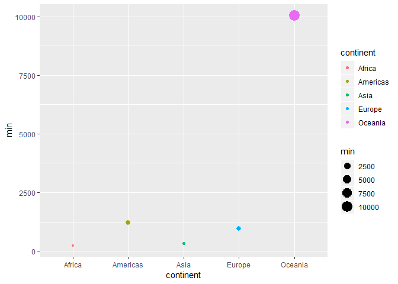
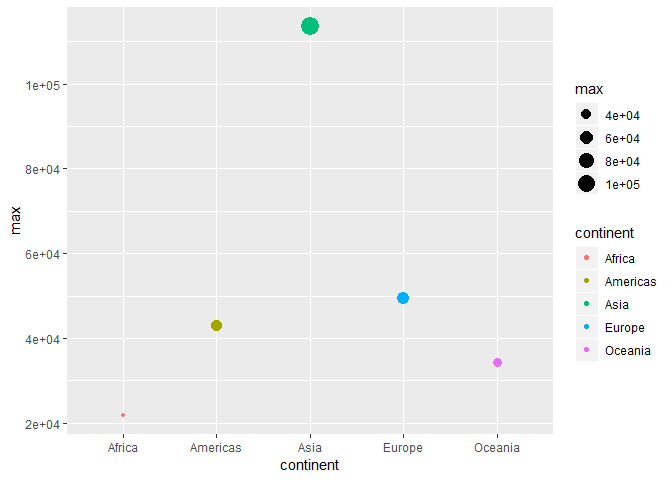
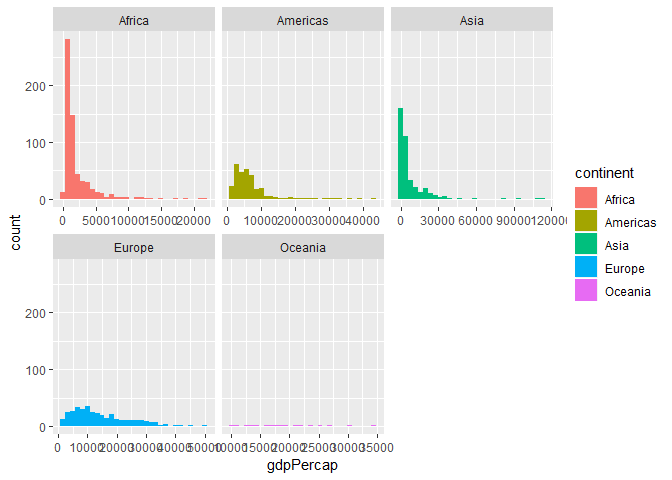
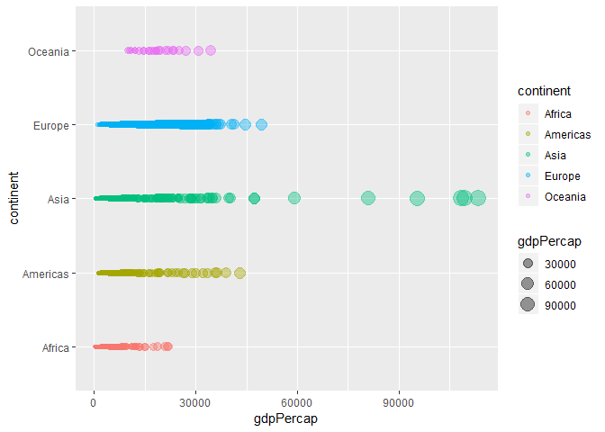
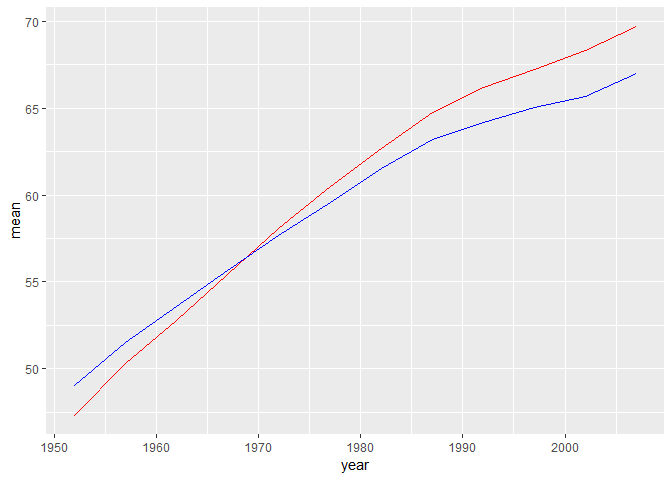
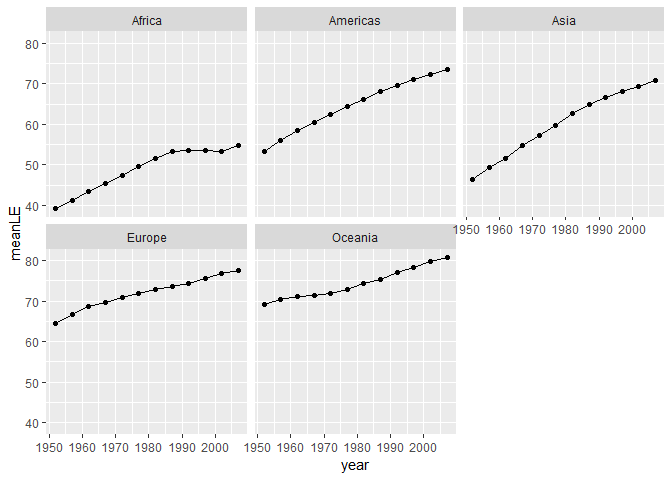
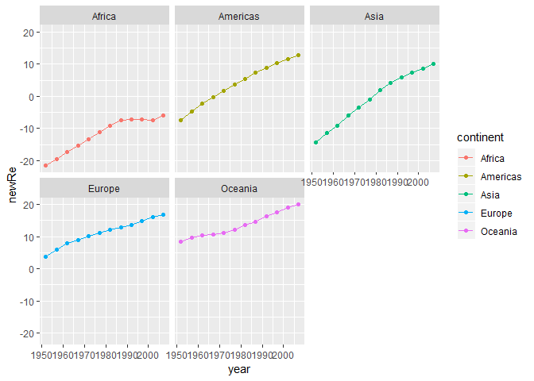
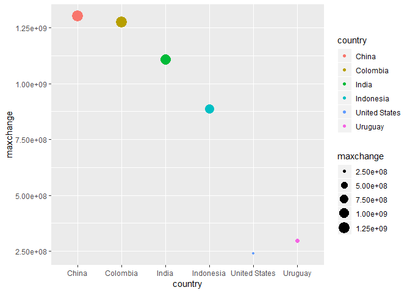

Assignment 3
================

This assignment can be treated as a convenient **Cheat Sheet**.
===============================================================

``` r
library(gapminder)
library(tidyverse)
```

    ## -- Attaching packages ------------------------------------------------------------------------------------ tidyverse 1.2.1 --

    ## √ ggplot2 3.0.0     √ purrr   0.2.5
    ## √ tibble  1.4.2     √ dplyr   0.7.6
    ## √ tidyr   0.8.1     √ stringr 1.3.1
    ## √ readr   1.1.1     √ forcats 0.3.0

    ## -- Conflicts --------------------------------------------------------------------------------------- tidyverse_conflicts() --
    ## x dplyr::filter() masks stats::filter()
    ## x dplyr::lag()    masks stats::lag()

### 1. Get the maximum and minimum of GDP per capita for all continents.

``` r
minGDP <-gapminder %>% 
  group_by(continent,country) %>% 
  summarize(min=min(gdpPercap)) %>% 
  summarize(min=min(min)) 
knitr::kable(minGDP)
```

| continent |         min|
|:----------|-----------:|
| Africa    |    241.1659|
| Americas  |   1201.6372|
| Asia      |    331.0000|
| Europe    |    973.5332|
| Oceania   |  10039.5956|

``` r
maxGDP <-gapminder %>% 
  group_by(continent,country) %>% 
  summarize(max=max(gdpPercap)) %>% 
  summarize(max=max(max)) 
knitr::kable(maxGDP)
```

| continent |        max|
|:----------|----------:|
| Africa    |   21951.21|
| Americas  |   42951.65|
| Asia      |  113523.13|
| Europe    |   49357.19|
| Oceania   |   34435.37|

``` r
  ## plot the minimum of GDP per capital for all continents
  ggplot(minGDP,aes(continent,min))+
  geom_point(aes(size=min,color=continent))
```



``` r
  ## plot the maximum of GDP per capital for all continents
    ggplot(maxGDP,aes(continent,max))+
  geom_point(aes(size=max,color=continent))
```



### 2. Look at the spread of GDP per capita within the continents

``` r
ggplot(gapminder, aes(gdpPercap))+
  facet_wrap(~continent, scales="free_x","free_y")+
  geom_histogram(aes(fill=continent))
```

    ## Warning: Coercing `nrow` to be an integer.

    ## Warning in sanitise_dim(nrow): Ç¿ÖƸıä¹ý³ÌÖвúÉúÁËNA

    ## Warning: `nrow` is missing or less than 1 and will be treated as NULL.

    ## `stat_bin()` using `bins = 30`. Pick better value with `binwidth`.



``` r
## we can also use combination of scatter plot and box plot to show the spread of the GDP per capita
ggplot(gapminder,aes(gdpPercap,continent))+
  geom_point(aes(colour=continent,size=gdpPercap),alpha=0.4)
```



### 3. Compute a trimmed mean of life expectancy for different years. Or a weighted mean, weighting by population.

the following is computed to find the 25% trimmed mean which is known as interquartile mean. The interquartile mean as well as the normal mean of lifeExp for each country are found:

``` r
temp <-gapminder %>% 
  group_by(year) %>% 
  summarize(trimmedMean=mean(lifeExp, trim=0.25),Mean=mean(lifeExp))
knitr::kable(temp)
```

|  year|  trimmedMean|      Mean|
|-----:|------------:|---------:|
|  1952|     47.33607|  49.05762|
|  1957|     50.27669|  51.50740|
|  1962|     52.79151|  53.60925|
|  1967|     55.43138|  55.67829|
|  1972|     58.07853|  57.64739|
|  1977|     60.46878|  59.57016|
|  1982|     62.70044|  61.53320|
|  1987|     64.76540|  63.21261|
|  1992|     66.19274|  64.16034|
|  1997|     67.25389|  65.01468|
|  2002|     68.30965|  65.69492|
|  2007|     69.68886|  67.00742|

These results can be compared using the below plot: Red line is the trend of the 25% trimmed mean while the blue line represents the trend of the normal mean.

``` r
ggplot(temp)+
  geom_line(aes(year,y=trimmedMean),color="red")+
  geom_line(aes(year,y=Mean),color="blue")+
  xlab("year")+
  ylab("mean")
```



Compute a weighted mean of lifeExp for different years, weighting by population.

``` r
 gapminder%>% 
  group_by(year) %>% 
 summarize(weighted.mean(lifeExp,pop)) 
```

    ## # A tibble: 12 x 2
    ##     year `weighted.mean(lifeExp, pop)`
    ##    <int>                         <dbl>
    ##  1  1952                          48.9
    ##  2  1957                          52.1
    ##  3  1962                          52.3
    ##  4  1967                          57.0
    ##  5  1972                          59.5
    ##  6  1977                          61.2
    ##  7  1982                          62.9
    ##  8  1987                          64.4
    ##  9  1992                          65.6
    ## 10  1997                          66.8
    ## 11  2002                          67.8
    ## 12  2007                          68.9

### 4. How is life expectancy changing over time on different continents?

First, we obtained the mean life expectancy over year on different continents. Then plot the life expectancy changing over time for each continent.

``` r
temp=gapminder%>% 
  group_by(year,continent) %>% 
  summarize(meanLE=mean(lifeExp))
knitr::kable(temp)
```

|  year| continent |    meanLE|
|-----:|:----------|---------:|
|  1952| Africa    |  39.13550|
|  1952| Americas  |  53.27984|
|  1952| Asia      |  46.31439|
|  1952| Europe    |  64.40850|
|  1952| Oceania   |  69.25500|
|  1957| Africa    |  41.26635|
|  1957| Americas  |  55.96028|
|  1957| Asia      |  49.31854|
|  1957| Europe    |  66.70307|
|  1957| Oceania   |  70.29500|
|  1962| Africa    |  43.31944|
|  1962| Americas  |  58.39876|
|  1962| Asia      |  51.56322|
|  1962| Europe    |  68.53923|
|  1962| Oceania   |  71.08500|
|  1967| Africa    |  45.33454|
|  1967| Americas  |  60.41092|
|  1967| Asia      |  54.66364|
|  1967| Europe    |  69.73760|
|  1967| Oceania   |  71.31000|
|  1972| Africa    |  47.45094|
|  1972| Americas  |  62.39492|
|  1972| Asia      |  57.31927|
|  1972| Europe    |  70.77503|
|  1972| Oceania   |  71.91000|
|  1977| Africa    |  49.58042|
|  1977| Americas  |  64.39156|
|  1977| Asia      |  59.61056|
|  1977| Europe    |  71.93777|
|  1977| Oceania   |  72.85500|
|  1982| Africa    |  51.59287|
|  1982| Americas  |  66.22884|
|  1982| Asia      |  62.61794|
|  1982| Europe    |  72.80640|
|  1982| Oceania   |  74.29000|
|  1987| Africa    |  53.34479|
|  1987| Americas  |  68.09072|
|  1987| Asia      |  64.85118|
|  1987| Europe    |  73.64217|
|  1987| Oceania   |  75.32000|
|  1992| Africa    |  53.62958|
|  1992| Americas  |  69.56836|
|  1992| Asia      |  66.53721|
|  1992| Europe    |  74.44010|
|  1992| Oceania   |  76.94500|
|  1997| Africa    |  53.59827|
|  1997| Americas  |  71.15048|
|  1997| Asia      |  68.02052|
|  1997| Europe    |  75.50517|
|  1997| Oceania   |  78.19000|
|  2002| Africa    |  53.32523|
|  2002| Americas  |  72.42204|
|  2002| Asia      |  69.23388|
|  2002| Europe    |  76.70060|
|  2002| Oceania   |  79.74000|
|  2007| Africa    |  54.80604|
|  2007| Americas  |  73.60812|
|  2007| Asia      |  70.72848|
|  2007| Europe    |  77.64860|
|  2007| Oceania   |  80.71950|

``` r
## plotting
ggplot(temp,aes(year,meanLE))+
  facet_wrap(~ continent)+
  geom_point()+
  geom_line()
```



### 5. Report the absolute and/or relative abundance of countries with low life expectancy over time by continent: Compute some measure of worldwide life expectancy – you decide – a mean or median or some other quantile or perhaps your current age. Then determine how many countries on each continent have a life expectancy less than this benchmark, for each year.

``` r
## first compute the median lifeExp as a worldwide life expectancy
temp<-gapminder %>% 
 mutate(worldM=median(lifeExp))


## take this as a benchmark and compute the relative abundance of countries over time by continent.
##First, i compute the relative abundance of countries for each country, then use group_by function to group the data by continent and time and again compute the mean relative abundance of countries within each continent.  The data is stored in variable newTable.
newTable <-temp %>% 
  mutate(re=lifeExp-worldM,lifeExp<=worldM) %>% 
  group_by(continent,year) %>% 
  summarize(newRe=mean(re))
knitr::kable(newTable)
```

| continent |  year|       newRe|
|:----------|-----:|-----------:|
| Africa    |  1952|  -21.577000|
| Africa    |  1957|  -19.446154|
| Africa    |  1962|  -17.393058|
| Africa    |  1967|  -15.377961|
| Africa    |  1972|  -13.261558|
| Africa    |  1977|  -11.132077|
| Africa    |  1982|   -9.119635|
| Africa    |  1987|   -7.367712|
| Africa    |  1992|   -7.082923|
| Africa    |  1997|   -7.114231|
| Africa    |  2002|   -7.387269|
| Africa    |  2007|   -5.906461|
| Americas  |  1952|   -7.432660|
| Americas  |  1957|   -4.752220|
| Americas  |  1962|   -2.313740|
| Americas  |  1967|   -0.301580|
| Americas  |  1972|    1.682420|
| Americas  |  1977|    3.679060|
| Americas  |  1982|    5.516340|
| Americas  |  1987|    7.378220|
| Americas  |  1992|    8.855860|
| Americas  |  1997|   10.437980|
| Americas  |  2002|   11.709540|
| Americas  |  2007|   12.895620|
| Asia      |  1952|  -14.398106|
| Asia      |  1957|  -11.393956|
| Asia      |  1962|   -9.149277|
| Asia      |  1967|   -6.048860|
| Asia      |  1972|   -3.393231|
| Asia      |  1977|   -1.101944|
| Asia      |  1982|    1.905439|
| Asia      |  1987|    4.138682|
| Asia      |  1992|    5.824712|
| Asia      |  1997|    7.308015|
| Asia      |  2002|    8.521379|
| Asia      |  2007|   10.015985|
| Europe    |  1952|    3.696000|
| Europe    |  1957|    5.990567|
| Europe    |  1962|    7.826733|
| Europe    |  1967|    9.025100|
| Europe    |  1972|   10.062533|
| Europe    |  1977|   11.225267|
| Europe    |  1982|   12.093900|
| Europe    |  1987|   12.929667|
| Europe    |  1992|   13.727600|
| Europe    |  1997|   14.792667|
| Europe    |  2002|   15.988100|
| Europe    |  2007|   16.936100|
| Oceania   |  1952|    8.542500|
| Oceania   |  1957|    9.582500|
| Oceania   |  1962|   10.372500|
| Oceania   |  1967|   10.597500|
| Oceania   |  1972|   11.197500|
| Oceania   |  1977|   12.142500|
| Oceania   |  1982|   13.577500|
| Oceania   |  1987|   14.607500|
| Oceania   |  1992|   16.232500|
| Oceania   |  1997|   17.477500|
| Oceania   |  2002|   19.027500|
| Oceania   |  2007|   20.007000|

``` r
## then I use ggplot to plot the relative lifeExp over year to better visualize the data for each continent.

ggplot(newTable,aes(year,newRe))+
  facet_wrap(~continent)+
  geom_point(aes(colour=continent))+
  geom_line(aes(colour=continent))
```



### 6. Find countries with interesting stories.

It is worth investgating that which country has the higher growing rate within these countries. We first compute the difference in population between the current year entry and the previous year entry. Then the maximum of these changes are computed and for convenience, only the top 6 of the records are plotted. As we can see from the plot, China, Columbia and India has the biggest growth in this time period followed by Indonesia, US and Urugguay.

``` r
maxPopChange <- gapminder %>% 
  arrange(year) %>% 
  mutate(popchange=pop-lag(pop,1)) %>% 
  filter(!is.na(popchange)) %>% 
  group_by(country) %>% 
  summarize(maxchange=max(abs(popchange))) %>% 
  arrange(desc(maxchange))
  
  
  top6=head(maxPopChange)
  knitr::kable(top6)
```

| country       |   maxchange|
|:--------------|-----------:|
| China         |  1302398355|
| Colombia      |  1274455546|
| India         |  1110094400|
| Indonesia     |   886849331|
| Uruguay       |   297692451|
| United States |   240363709|

``` r
  top6%>% 
  ggplot(aes(country,maxchange))+
    geom_point(aes(size=maxchange,colour=country))
```


